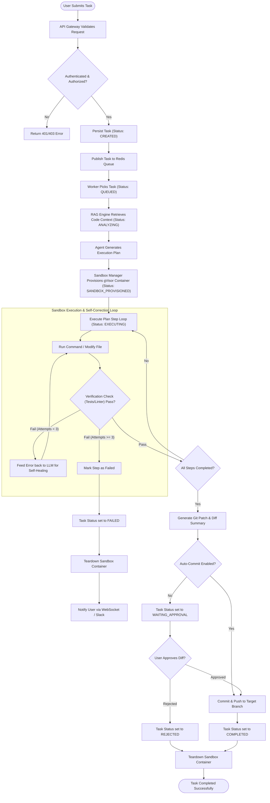
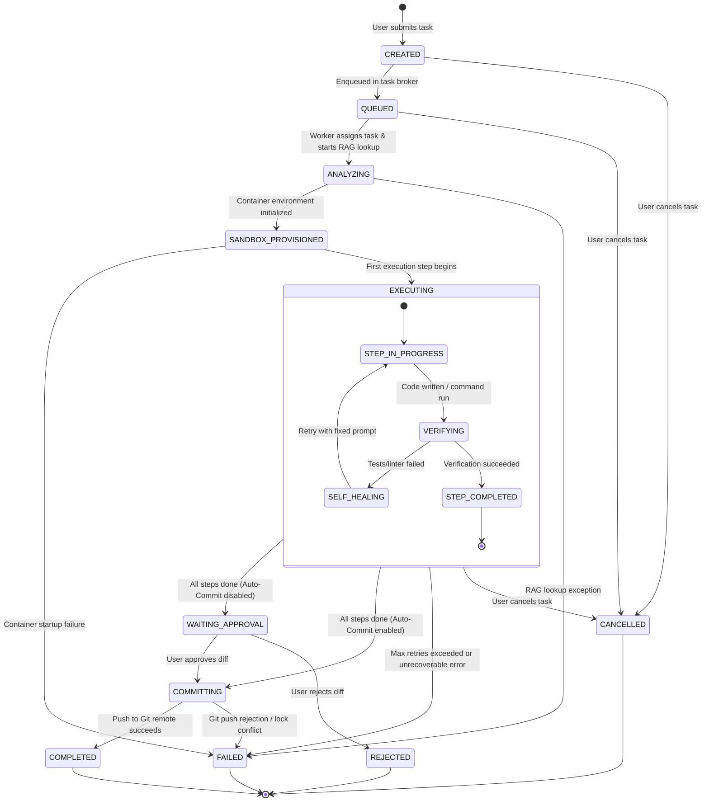
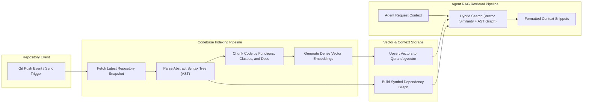
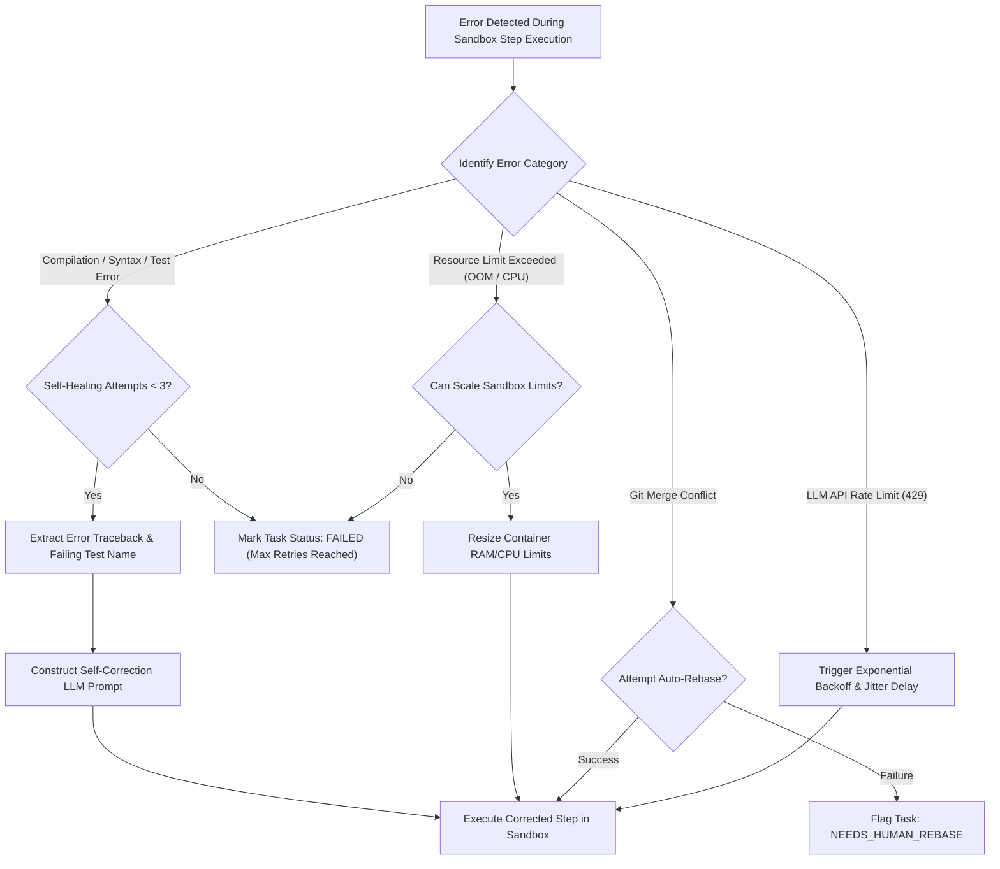

# Issueforge - Process & System Workflows (FLOW) Document

> **Design history, not current behaviour.** This document describes an earlier planned architecture, including Redis and gVisor, neither of which was built. The implemented system is described in [README.md](../README.md): auth is one shared `FORGE_AUTH_TOKEN`, storage is SQLite, and there is no container sandbox — sandboxes are plain directories and agents run with the user's full permissions.

## 1. End-to-End Task Execution Flow

This document details the operational execution flows, state transitions, decision trees, and data processing pipelines within **Issueforge**.

### 1.1 Complete Task Lifecycle Diagram

---

## 2. State Transition Model

The state transition diagram below describes all permissible status states for an Issueforge task and the events triggering state changes.

---

## 3. Data Processing & RAG Ingestion Pipeline

Issueforge indexes git repositories to provide precise, low-latency codebase retrieval during agent execution.

### 3.1 RAG Ingestion Steps:
1. **Tree Parsing**: Converts source code into Abstract Syntax Trees (AST) using Tree-sitter parsers.
2. **Semantic Chunking**: Splits code cleanly along logical function, class, and docstring boundaries rather than arbitrary line counts.
3. **Embedding Generation**: Computes code embeddings using specialized code-embedding models (e.g., `text-embedding-3-large` or `CodeBERT`).
4. **Hybrid Context Retrieval**: Combines cosine similarity vector search with AST graph traversal to return both target code blocks and dependent interface definitions.

---

## 4. Decision-Tree & Error Recovery Logic

### 4.1 Error Recovery Rules:
* **Rule 1 (Syntax / Logic Errors)**: Automatically captured by test runners or linters, passed back to LLM context up to 3 times before failing the step.
* **Rule 2 (System Resource Exhaustion)**: Dynamically resizes container memory limits up to configured maximum threshold before aborting execution.
* **Rule 3 (External API Failures)**: Applies exponential backoff with full jitter to protect against external rate limits and API service degrades.
