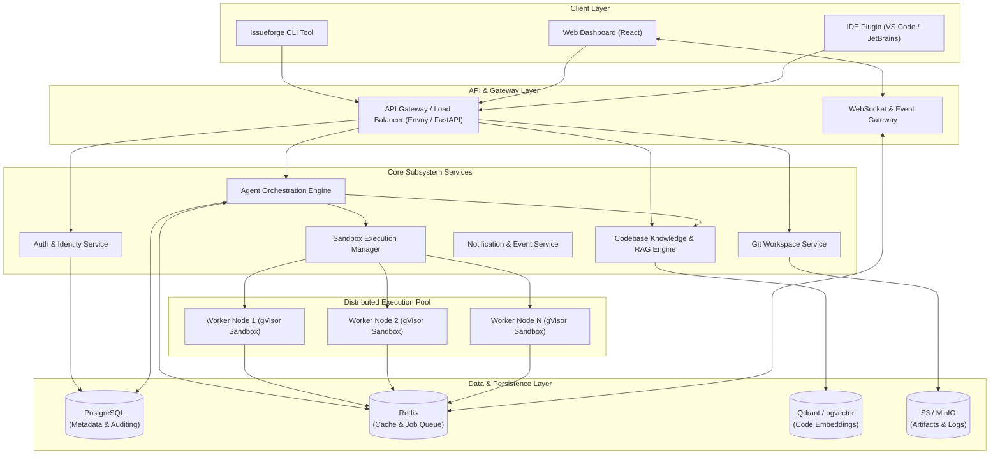
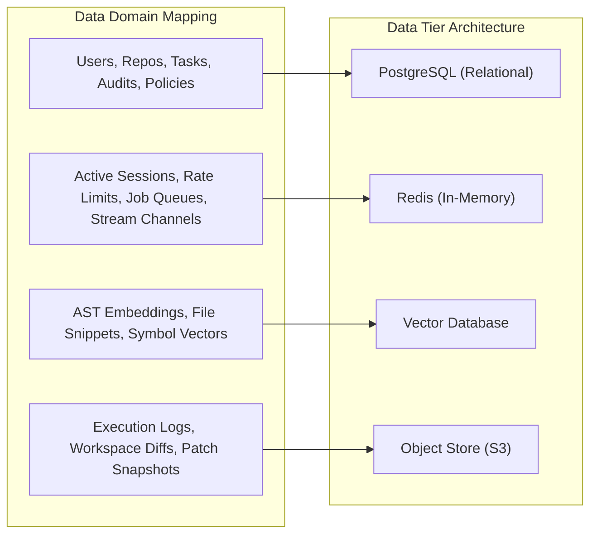

# Issueforge - High-Level Design (HLD) Document

> **Design history, not current behaviour.** This document describes an earlier planned architecture, including JWT/OAuth2/RBAC, Redis, PostgreSQL and gVisor/Docker/Firecracker isolation, none of which was built. The implemented system is described in [README.md](../README.md): auth is one shared `FORGE_AUTH_TOKEN`, storage is SQLite, and there is no container sandbox — sandboxes are plain directories and agents run with the user's full permissions.

## 1. Executive Summary & System Purpose

**Issueforge** (Agentic Git) is an enterprise-grade, AI-driven version control automation and software engineering agent platform. It provides an autonomous software development environment capable of analyzing repositories, planning architectural changes, writing clean code, running verification suites, and managing Git workflows seamlessly alongside human developers.

The primary objectives of Issueforge are:
* **Autonomous Task Execution**: Execute multi-step coding, refactoring, and documentation tasks inside secure, isolated sandboxes.
* **Context-Aware Repository Intelligence**: Index codebases using hybrid vector and graph embeddings (Retrieval-Augmented Generation / RAG) to supply precise repository context to LLM agents.
* **Granular Governance & Security**: Enforce strict role-based access control (RBAC), auditing, sandboxing, and manual approval gates before code is committed or merged.
* **Scalable Event-Driven Architecture**: Support high-concurrency background job processing, asynchronous execution pipelines, and real-time event streaming.

---

## 2. High-Level System Architecture

Issueforge follows a microservices-based, event-driven architecture designed for high availability, fault tolerance, and secure code execution.

---

## 3. Subsystem Component Breakdown

### 3.1 Client Layer
* **Issueforge CLI**: Command-line client facilitating task submission, repository initialization, workspace sync, and stream viewing.
* **Web Dashboard**: Modern single-page application providing task execution monitoring, interactive diff reviews, approval management, and project analytics.
* **IDE Extensions**: Developer integration tools providing in-editor AI agent task launching and diff application.

### 3.2 Gateway & Transport Layer
* **API Gateway**: Entry point for REST and gRPC requests. Responsible for TLS termination, rate limiting, request validation, and routing.
* **WebSocket Gateway**: Maintains persistent full-duplex connections to clients for real-time output log streaming and state updates.

### 3.3 Core Application Services
* **Auth & Identity Service**: Handles multi-tenant user authentication, OAuth2 / OIDC providers, API key management, and RBAC authorization policies.
* **Agent Orchestration Engine**: The core decision-making hub. Formulates execution plans, breaks tasks down into structured sub-steps, manages LLM prompt contexts, and coordinates step transitions.
* **Git Workspace Service**: Manages Git repository mirroring, branch isolation, workspace diff generation, tree parsing, and integration with remote hosts (GitHub, GitLab, Bitbucket).
* **Sandbox Execution Manager**: Provisions runtime environments for task execution. Uses container/microVM virtualization (e.g., Docker, gVisor, Firecracker) to enforce strict limits on resource usage, disk I/O, and network access.
* **Codebase Knowledge & RAG Engine**: Indexes code repositories into semantic syntax trees and vector embeddings. Supplies relevant context snippets to agents during prompt construction.
* **Notification & Event Service**: Listens to system events and dispatches notifications across WebSockets, webhooks, Slack, and email channels.

---

## 4. Technology Stack Specification

| Tier / Component | Technology | Rationale |
| :--- | :--- | :--- |
| **API Framework** | FastAPI (Python 3.11+) / Go | High performance, native async/await support, OpenAPI documentation generation. |
| **Frontend Framework** | React, TypeScript, TailwindCSS | Component reusability, strong ecosystem, responsive real-time UI rendering. |
| **Agent Orchestrator** | Python / Asyncio / LangGraph | Dynamic graph-based state machines, flexible tool orchestration. |
| **Database** | PostgreSQL 15+ | ACID compliance, JSONB document support, robust spatial and relational querying. |
| **Cache & Queue** | Redis 7+ / Celery / BullMQ | Sub-millisecond latency caching, pub/sub log streaming, distributed task queuing. |
| **Vector Storage** | Qdrant / pgvector | High-dimensional vector similarity search, filtered semantic search over code structures. |
| **Object Storage** | MinIO / AWS S3 | Scalable store for task artifacts, patch files, execution logs, and repository snapshots. |
| **Sandboxing** | gVisor / Docker / Firecracker | Strong multi-tenant security isolation preventing arbitrary code execution escapes. |
| **Inter-Service Comms**| gRPC & REST (HTTP/2), WebSockets | Binary gRPC for high-throughput service communication; WebSockets for frontend streaming. |

---

## 5. Data Persistence & Storage Model

* **Relational Storage (PostgreSQL)**: Holds structured domain models including User profiles, Organizations, Repositories, Task metadata, Step history, and Audit records.
* **In-Memory Cache & Message Broker (Redis)**: Serves as low-latency cache for authentication tokens, distributed lock manager for repository operations, message broker for task execution queues, and Pub/Sub router for streaming logs.
* **Vector Database (Qdrant/pgvector)**: Stores dense vector representations of code functions, documentation, and AST nodes for semantic search and RAG context generation.
* **Object Store (S3/MinIO)**: Stores unstructured binary assets, raw container logs, workspace patches, and tarballed repository snapshots.

---

## 6. Security, Isolation & Compliance Model

1. **Authentication & Authorization**:
   - JWT tokens signed with RS256 algorithm for API authentication.
   - Fine-grained Role-Based Access Control (RBAC): Roles (`Admin`, `Maintainer`, `Developer`, `Viewer`) govern actions on repositories and task execution.
2. **Sandbox Isolation**:
   - Non-root user execution inside isolated containers (gVisor/Firecracker).
   - Enforced resource quotas: CPU execution caps, RAM allocation boundaries, ephemeral disk size limits.
   - Outbound network egress filtering: Restricted strictly to authorized domains (e.g., package registries, LLM API endpoints).
3. **Secret Protection**:
   - Vault integration for encrypted storage of Git access tokens and LLM API keys.
   - Dynamic injection of short-lived credentials into execution sandboxes.
4. **Audit Logging**:
   - Immutable audit logs for all system interactions, prompt dispatches, code modifications, and repository commits.

---

## 7. Scalability & High Availability Strategy

* **Stateless Service Tier**: All API, Gateway, and Orchestrator service instances are fully stateless, allowing seamless horizontal scaling behind load balancers.
* **Asynchronous Execution Pools**: Heavy task execution (LLM generation, code compilation, test suite execution) is offloaded to dynamic worker pools scaled based on queue depth metrics.
* **Database Read Replicas**: Database query load is split between primary read-write PostgreSQL nodes and scaled read-replicas.
* **Circuit Breakers & Backpressure**: External API calls to LLMs and third-party Git hosts are protected with circuit breakers, exponential backoff retries, and rate-limiting middleware to maintain platform stability under failure conditions.
