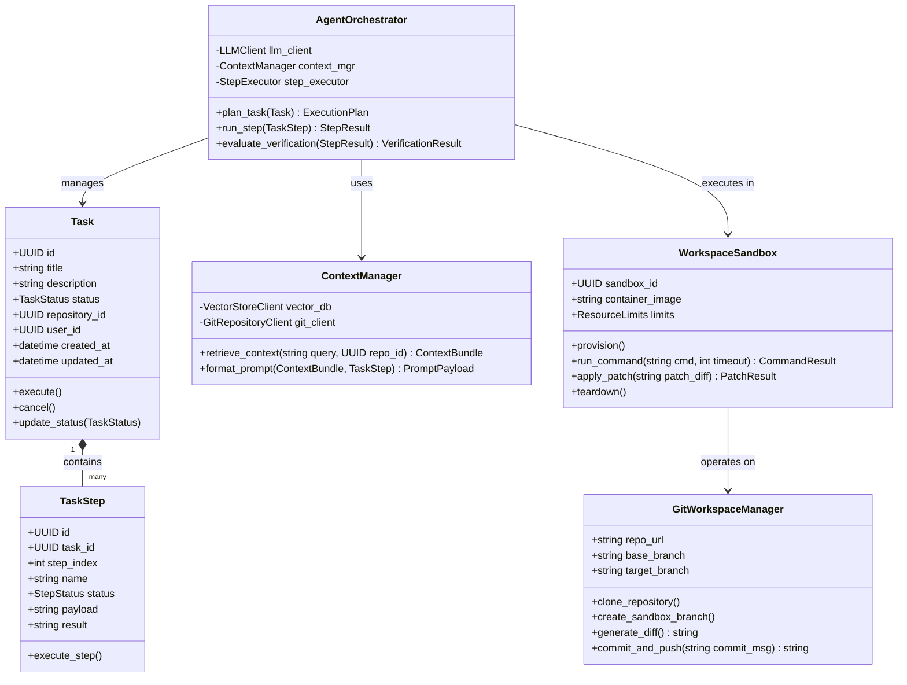
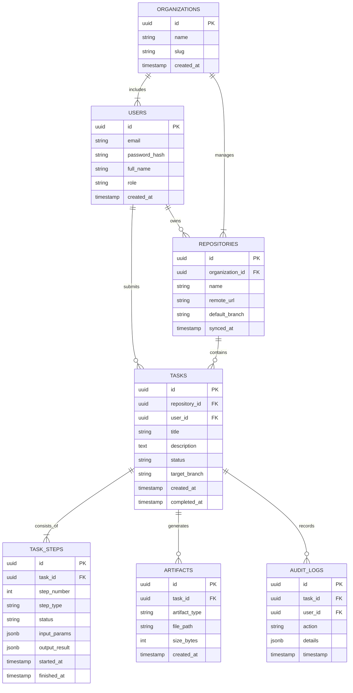
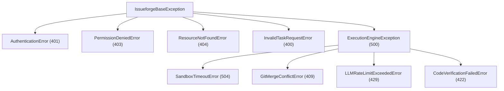

# Issueforge - Low-Level Design (LLD) Document

> **Design history, not current behaviour.** This document describes an earlier planned architecture, including JWT auth, PostgreSQL schemas and `/api/v1` endpoints, none of which was built (routes live under `/api/`). The implemented system is described in [README.md](../README.md): auth is one shared `FORGE_AUTH_TOKEN`, storage is SQLite, and there is no container sandbox — sandboxes are plain directories and agents run with the user's full permissions.

## 1. Module & Class Blueprints

The core domain logic of Issueforge is modularly structured across four primary sub-packages: Orchestration, Workspace, Execution, and Storage.

### 1.1 Class Architecture Diagram



---

## 2. Database Schemas & Data Models

Issueforge uses PostgreSQL as its core metadata store. The Entity-Relationship (ER) diagram below illustrates the database architecture.



---

## 3. Data Transfer Objects (DTOs) & JSON Schemas

### 3.1 Task Creation Request DTO
```json
{
  "$schema": "http://json-schema.org/draft-07/schema#",
  "title": "CreateTaskRequest",
  "type": "object",
  "properties": {
    "repository_id": {
      "type": "string",
      "format": "uuid"
    },
    "title": {
      "type": "string",
      "minLength": 3,
      "maxLength": 128
    },
    "description": {
      "type": "string",
      "minLength": 10
    },
    "base_branch": {
      "type": "string",
      "default": "main"
    },
    "auto_commit": {
      "type": "boolean",
      "default": false
    }
  },
  "required": ["repository_id", "title", "description"]
}
```

### 3.2 Task Response DTO
```json
{
  "task_id": "9f8b4c2e-1234-4567-89ab-cdef01234567",
  "repository_id": "a1b2c3d4-5678-90ab-cdef-1234567890ab",
  "title": "Implement JWT Refresh Token Rotation",
  "status": "EXECUTING",
  "current_step": 2,
  "total_steps": 4,
  "created_at": "2026-09-11T00:00:00Z",
  "steps": [
    {
      "step_number": 1,
      "name": "Context Indexing & Code Search",
      "status": "COMPLETED",
      "started_at": "2026-09-11T00:00:01Z",
      "finished_at": "2026-09-11T00:00:05Z"
    },
    {
      "step_number": 2,
      "name": "Code Patch Generation",
      "status": "IN_PROGRESS",
      "started_at": "2026-09-11T00:00:06Z",
      "finished_at": null
    }
  ]
}
```

---

## 4. API Endpoints & Interfaces

### 4.1 RESTful Web APIs

| Method | Endpoint Path | Description | Access Level |
| :--- | :--- | :--- | :--- |
| `POST` | `/api/v1/auth/login` | Authenticate user & return JWT tokens | Public |
| `POST` | `/api/v1/auth/refresh` | Refresh expired JWT access token | Authenticated |
| `GET` | `/api/v1/repositories` | List repositories accessible to user | Authenticated |
| `POST` | `/api/v1/repositories/sync` | Trigger manual Git metadata & vector sync | Developer |
| `POST` | `/api/v1/tasks` | Create and enqueue a new AI coding task | Developer |
| `GET` | `/api/v1/tasks/{id}` | Get full details & status of a task | Viewer |
| `POST` | `/api/v1/tasks/{id}/cancel` | Cancel an ongoing task execution | Maintainer |
| `GET` | `/api/v1/tasks/{id}/diff` | Retrieve code diff generated by task | Viewer |
| `POST` | `/api/v1/tasks/{id}/approve` | Approve diff & push commit to remote branch | Maintainer |

### 4.2 WebSocket Streaming Interface

* **Endpoint**: `ws://api.issueforge.internal/ws/v1/tasks/{task_id}/stream`
* **Protocol**: JSON over WebSockets
* **Frame Message Types**:
  * `log_chunk`: Ephemeral console output from the task sandbox execution.
  * `step_transition`: Signals transition from one execution step to the next.
  * `diff_updated`: Sent when a file modification step completes.
  * `task_status_changed`: Fired when task enters `COMPLETED`, `FAILED`, or `WAITING_APPROVAL` states.

---

## 5. Error Handling & Exception Management

Issueforge defines a clear exception hierarchy to ensure errors are caught gracefully, logged with context, and returned to clients via standard RFC 7807 Problem Details.



### 5.1 Exception Handling Policy & Retry Strategies

1. **Transient Errors (e.g., LLM Rate Limits, Network Timeout)**:
   - **Strategy**: Handled via exponential backoff with full jitter.
   - **Retry Parameters**: Max retries = 5, Initial delay = 1s, Max delay = 30s.
2. **Sandbox Execution Failures (e.g., Syntax Error in Generated Code)**:
   - **Strategy**: Self-Correction Feedback Loop.
   - **Action**: Feed error traceback back into LLM context; request self-healing code modification (up to 3 repair attempts).
3. **Fatal / Non-Recoverable Errors (e.g., Git Auth Revoked, Invalid Repo Schema)**:
   - **Strategy**: Immediate failure termination.
   - **Action**: Set Task status to `FAILED`, record detailed diagnostics in `AUDIT_LOGS`, notify user via WebSocket & Email.
