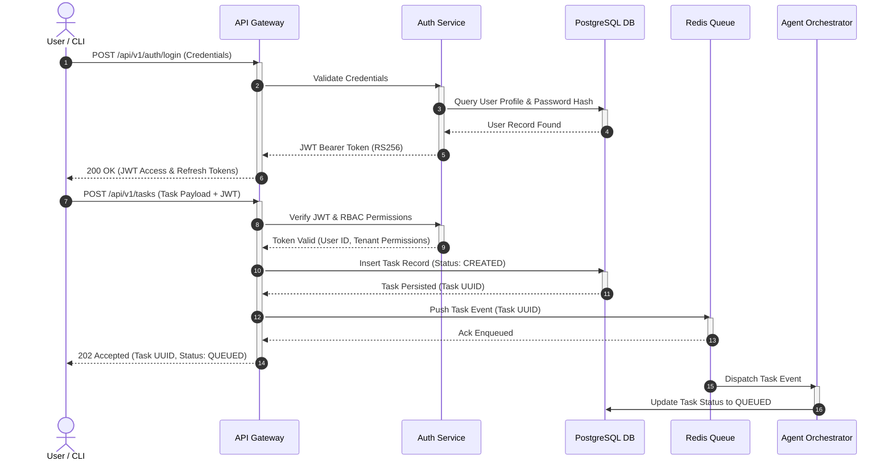
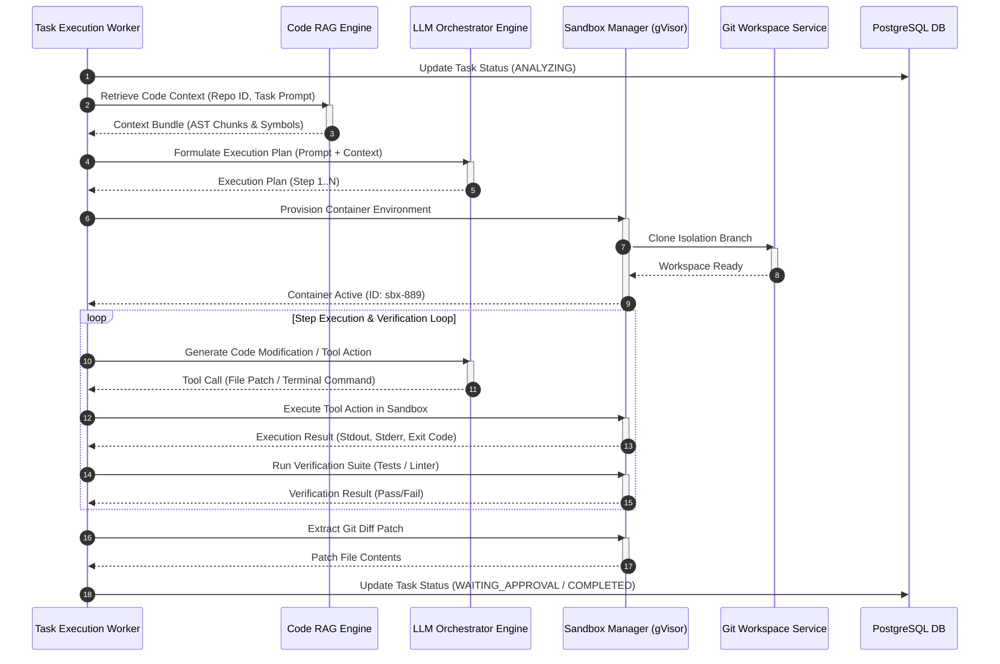
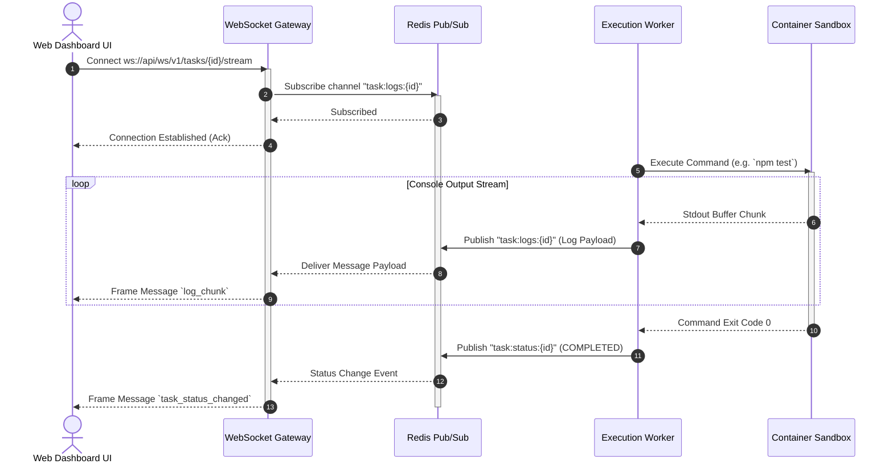
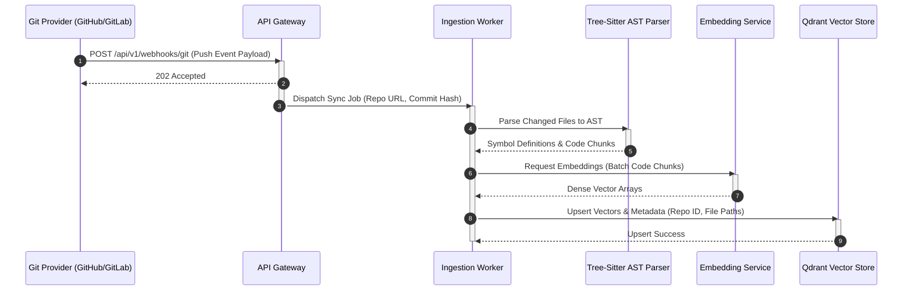
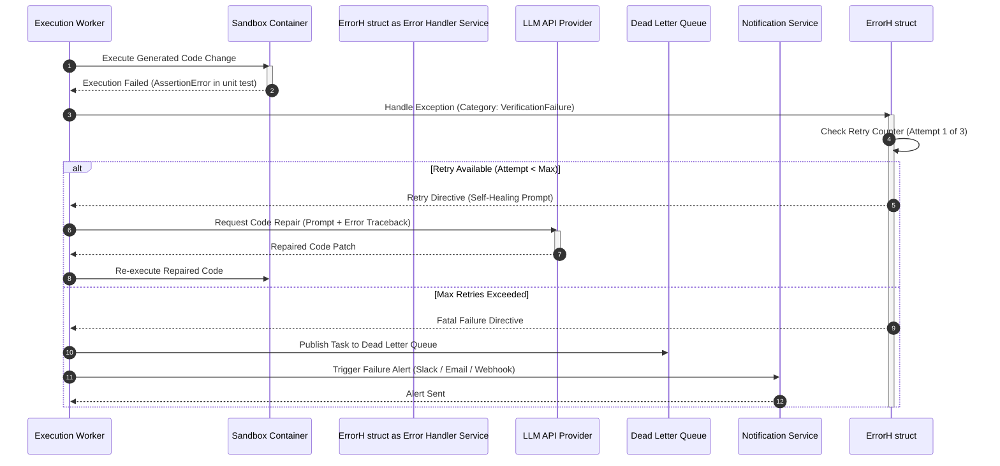

# Issueforge - Sequence Diagrams (SEQUENCE_DIAGRAM) Document

> **Design history, not current behaviour.** This document describes an earlier planned architecture, including a JWT/RBAC login flow, Redis, PostgreSQL, `/api/v1` and gVisor, none of which was built. The implemented system is described in [README.md](../README.md): auth is one shared `FORGE_AUTH_TOKEN`, storage is SQLite, and there is no container sandbox — sandboxes are plain directories and agents run with the user's full permissions.

This document presents detailed Mermaid sequence diagrams illustrating step-by-step subsystem interactions across key operational workflows in **Issueforge**.

---

## 1. Scenario 1: User Task Initialization & Authentication Flow

Illustrates client authentication, token verification, task payload validation, and initial database persistence.

---

## 2. Scenario 2: Core Task Execution & Agent Subsystem Interaction

Details the core agent decision loop, RAG context retrieval, sandbox command execution, and verification steps.

---

## 3. Scenario 3: Asynchronous Task Processing & Real-Time Log Streaming

Shows how terminal output generated inside an execution sandbox is streamed via Redis Pub/Sub and WebSockets to the Web Dashboard.

---

## 4. Scenario 4: Data Sync & RAG Code Indexing Pipeline

Illustrates automated codebase ingestion triggered by git webhooks.

---

## 5. Scenario 5: Error Propagation, Retries, and Circuit Breaking

Demonstrates handling of transient infrastructure failures, retries, self-correction, and fallback pathways.

